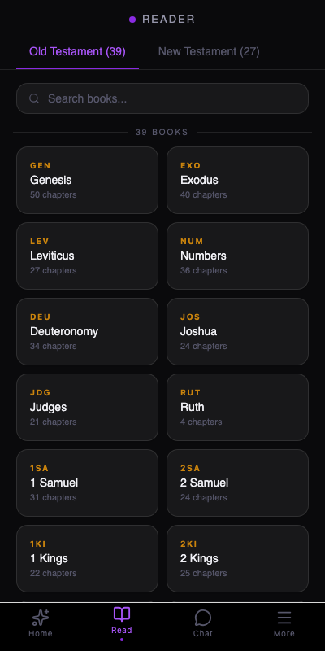
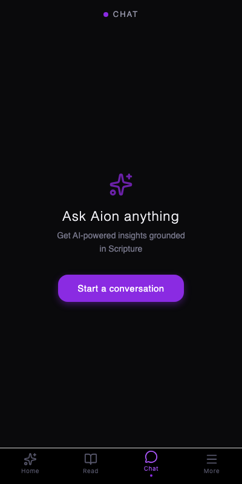
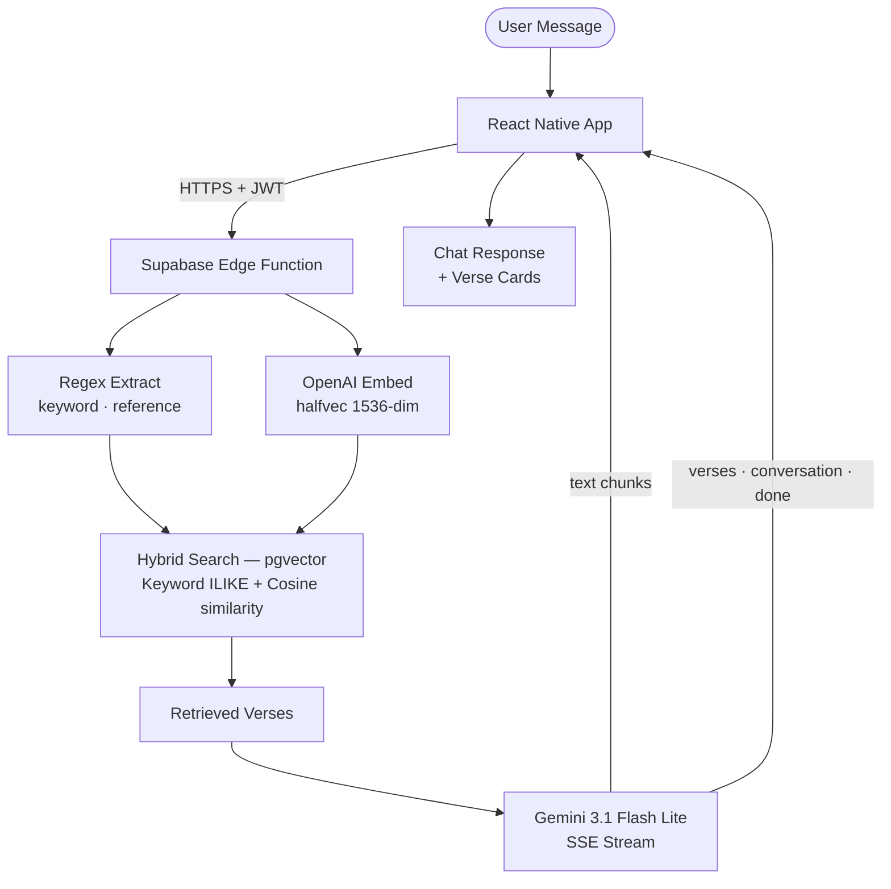

# Aion


AI-powered Bible companion using Agentic Hybrid RAG (Retrieval-Augmented Generation).

Users interact through a Perplexity-style chat interface with dynamic prompt suggestions and rich verse cards. All AI responses are grounded in actual Bible data retrieved via combined keyword and semantic search.

## Features

- **Conversational Bible Q&A** — Ask questions in plain language and receive contextual answers grounded in scripture
- **Hybrid RAG retrieval** — Combines keyword matching and semantic vector search (pgvector) for precise verse lookup
- **Streaming responses** — Real-time SSE streaming from Gemini via Supabase Edge Functions
- **Bible reader** — Browse all 66 books, select chapters, and read with custom per-book background art
- **Rich verse cards** — Inline Bible verse display with book, chapter, and verse attribution
- **Verse highlights & bookmarks** — Colour-coded highlighting and bookmarking persisted per user
- **Voice-to-text** — Mic input via Web Speech API (web) or OpenAI Whisper (iOS/Android)
- **Text-to-speech** — Read-aloud support via platform TTS engines
- **Daily verse notifications** — Push notification with a rotating verse of the day
- **Prompt suggestions** — Dynamic suggestion pills on the home screen to inspire exploration
- **Conversation history** — Persistent chat history accessible from the More tab
- **Settings** — Font size and theme controls
- **Anonymous auth** — Zero sign-up friction; users are authenticated silently on first launch
- **Rate limiting & caching** — IP-based rate limits and exact-match response cache to control costs

## Screenshots

<div align="center">
  
  
  
</div>

## Tech Stack

- **Frontend:** React Native + Expo + Expo Router
- **Desktop:** Tauri v2 (native macOS/Windows/Linux wrapper, ~5MB)
- **Backend:** Supabase (PostgreSQL + pgvector + Edge Functions)
- **Auth:** Supabase Anonymous Auth
- **Embedding Model:** OpenAI `text-embedding-3-small` (stored as `halfvec(1536)`)
- **Chat LLM:** Gemini 3.1 Flash Lite
- **Voice Transcription:** OpenAI Whisper (native platforms)
- **Data Source:** [bible.helloao.org](https://bible.helloao.org/docs/) (BSB translation)
- **Client Caching:** @tanstack/react-query

## Architecture



## Project Structure

```
Aion/
├── app/                            # Expo Router screens
│   ├── _layout.tsx                 # Root layout (auth + anonymous session)
│   ├── (tabs)/                     # Bottom tab navigation
│   │   ├── _layout.tsx             # Tab bar layout (Home / Read / Chat / More)
│   │   ├── index.tsx               # Home screen (VOTD + prompt pills)
│   │   ├── read.tsx                # Bible browser (book/chapter selection)
│   │   ├── chat.tsx                # Chat history list
│   │   └── more.tsx                # History + settings entry
│   ├── chat/
│   │   └── [id].tsx                # Active chat screen (streaming + verse cards)
│   └── reader/
│       ├── _layout.tsx             # Reader stack layout
│       └── [bookId]/
│           ├── index.tsx           # Chapter list for a book
│           └── [chapter].tsx       # Chapter reader with per-book backgrounds
├── components/                     # Shared React Native components
│   ├── BookArtTuner.tsx            # Dev tool: per-book background image tuner
│   ├── BookBackground.tsx          # Custom background renderer (transform + gradient)
│   ├── ChatBubble.tsx              # Message bubbles (user + assistant)
│   ├── ChatInput.tsx               # Text input + voice-to-text + send
│   ├── HistoryDrawer.tsx           # Legacy conversation history sidebar
│   ├── Onboarding.tsx              # First-launch onboarding flow
│   ├── PromptPill.tsx              # Suggestion prompt chips
│   ├── SettingsSheet.tsx           # Settings bottom sheet (font size, theme)
│   └── VerseCard.tsx               # Bible verse display card with copy
├── lib/                            # Shared utilities and hooks
│   ├── bible-data.ts               # OT/NT book lists, VOTD rotation logic
│   ├── bookBackgroundSettings.ts   # Per-book background settings (AsyncStorage)
│   ├── chat.ts                     # SSE streaming + Supabase API calls
│   ├── notifications.ts            # Daily verse push notifications
│   ├── settings.tsx                # App-wide settings (font size, theme)
│   ├── supabase.ts                 # Supabase client + isSupabaseConfigured helper
│   ├── theme.ts                    # Design system (colours, fonts, tokens)
│   ├── tts.ts                      # Text-to-speech engine (web + native)
│   ├── types.ts                    # TypeScript interfaces
│   └── utils.ts                    # Relative time formatting utility
├── assets/                         # Images and fonts
│   └── *.png                       # App icons + per-book background images (all 66 books)
├── src-tauri/                      # Tauri desktop app wrapper
│   ├── src/                        # Rust entry points
│   ├── icons/                      # App icons (all platforms)
│   └── tauri.conf.json             # Tauri configuration
├── scripts/
│   ├── ingest.ts                   # Full Bible ingestion pipeline (BSB + embeddings)
│   └── fix-incomplete.ts           # Targeted re-ingest for incomplete books
├── supabase/
│   ├── migrations/                 # 5 SQL migration files (see Setup)
│   └── functions/chat/index.ts     # RAG Edge Function (Deno runtime)
├── tests/                          # Node.js test suite (tsx runner, 79 tests)
│   ├── bible-data.test.ts
│   ├── bible-reference-parser.test.ts
│   ├── bookBackgroundSettings.test.ts
│   ├── notifications.test.ts
│   ├── settings.test.ts
│   ├── streak-helpers.test.ts
│   ├── supabase.test.ts
│   ├── tts.test.ts
│   └── utils.test.ts
├── check.sh                        # Quality gate: format → lint → type-check → test
└── docs/
    ├── API.md                      # Edge Function & PostgREST API docs
    ├── ARCHITECTURE.md             # System architecture & data flow
    ├── DEPLOYMENT.md               # Production deployment guide
    ├── ENVIRONMENT.md              # Environment variables list
    ├── SETUP.md                    # Local setup instructions
    ├── TESTING.md                  # Test suite documentation
    └── TROUBLESHOOTING.md          # Common development issues
```

## Setup

Please refer to the comprehensive setup instructions in [docs/SETUP.md](docs/SETUP.md).

## Development

```bash
# Quality gate (format + lint + type-check + tests)
./check.sh

# Type-check only
npm run type-check

# Lint
npm run lint

# Format
npm run format

# Run tests
npm test

# Run on iOS simulator
npx expo run:ios

# Run on Android emulator
npx expo run:android

# Run desktop app (dev mode)
npm run desktop

# Build desktop app (production)
npm run desktop:build
```

See [docs/TESTING.md](docs/TESTING.md) for details on the test suite and [docs/DEPLOYMENT.md](docs/DEPLOYMENT.md) for production deployment steps.

## Security

- **API keys server-side only:** OpenAI, Gemini, and service_role keys stored as Edge Function secrets
- **IP-based rate limiting:** 5/min burst, 30/3hrs per IP, 200/day global cap
- **Response cache:** Exact-match queries served from DB at zero LLM cost
- **Message length cap:** 500 characters max to prevent token-stuffing
- **RLS enforced:** All tables protected; users can only access their own data
- **IDOR protection:** Conversation ownership verified before any write operation
- **SQL injection protection:** LIKE wildcards escaped in keyword search
- **Dev bypass:** Secret header for testing, excluded from production builds
- **Fail-closed:** Rate limit errors default to deny

## Contributing

Contributions are welcome. Please read [CONTRIBUTING.md](CONTRIBUTING.md) before opening a pull request.

## License

See [LICENSE](LICENSE) for details.
